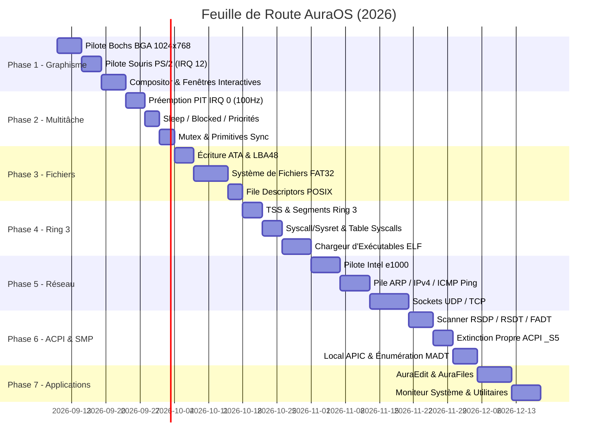

# 🚀 AuraOS — Analyse Approfondie & Feuille de Route d'Ingénierie Système

> **Document de Référence Technique — Spécification Complète des Fonctionnalités à Développer**  
> **Auteur & Architecte Système :** Niaina  
> **Version du Noyau Actuel :** v0.1.0 Bare-Metal (x86_64 Long Mode)  
> **Objectif :** Transformer le noyau bare-metal démonstrateur en un **Système d'Exploitation Graphique, Préemptif, Persistant et Multitâche Complet**.

---

## 1. 📊 Matrice d'Analyse Approfondie de l'Existant (Bilan & Limitations)

| Sous-Système | État Actuel (v0.1.0) | Limitations Techniques Actuelles | Impact sur l'Expérience |
| :--- | :--- | :--- | :--- |
| **Affichage & Vidéo** | Mode texte VGA 80x25 (MMIO `0xb8000`). Moteur graphique Canvas 32bpp présent en RAM mais non affiché. | Aucun accès direct au framebuffer vidéo physique en haute résolution. | L'utilisateur ne voit que du texte vert/cyan sur fond noir, le bureau macOS reste confiné à la mémoire. |
| **Périphériques d'Entrée** | Clavier PS/2 (Intel 8042 sur IRQ 1). Scancode Set 1 décodé avec ring buffer. | Souris PS/2 inexistante. Touches fléchées, touches de fonction (F1-F12), Ctrl, Alt non supportées. | Impossible d'interagir graphiquement (pas de pointeur), navigation CLI sans historique fléché. |
| **Multitâche & Ordonnancement** | Multitâche coopératif (`yield_now()`). TCB avec piles 16 KiB conformes System V ABI. | Pas de préemption temporelle. Si une tâche boucle sans relâcher la main (`loop {}`), tout le système est figé. | Vulnérabilité au gel de l'OS en cas de bug dans une tâche, inaptitude au multitâche intensif. |
| **Gestion Mémoire** | Tas dynamique de 8 MiB (fusion sans fuite). Abstractions de pagination x86_64 4-Level. | Pas d'allocateur physique de trames dynamique. Espace d'adressage unique partagé pour tout le noyau. | Pas d'isolation de mémoire entre processus (si Ring 3), impossible d'allouer plus de 8 Mo. |
| **Stockage & Fichiers** | VFS en mémoire vive (RAMFS avec inodes virtuels). Pilote ATA PIO 28-bit en lecture seule (`readsec`). | Volatilité totale (tout s'efface au reboot). Pas d'écriture de secteurs sur disque. Pas de système de fichiers réel (FAT32/ext2). | Aucune persistance des données. Tout fichier créé via `write` ou `touch` disparaît à l'extinction. |
| **Privilèges & Sécurité** | Tout s'exécute en Ring 0 (Privilège Kernel absolu). | Pas de Ring 3 (Espace Utilisateur), pas de TSS (Task State Segment), pas d'appels système (`syscall`). | Une erreur dans n'importe quel code plante tout le système. Pas d'exécution de binaires externes. |
| **Réseau** | Détection matérielle PCI de la carte réseau Intel e1000 (`8086:100e`). | Aucun pilote d'initialisation, pas d'anneaux DMA de paquets, pas de pile TCP/IP. | Système totalement déconnecté, aucun accès local ou distant. |
| **Gestion Énergie & ACPI** | Commandes `reboot` (clavier 8042) et `halt` (HLT loop). | Pas de gestion ACPI (AML/DSDT), extinction réelle via port QEMU uniquement. | Impossible d'éteindre proprement un vrai PC physique, consommation d'énergie non optimisée. |

---

## 2. 🌟 Phase 1 : Rendu Graphique Réel & Bureau Interactif (Priorité Immédiate)

### 2.1. Pilote Graphique Bochs BGA / VBE (1024x768x32bpp TrueColor)
* **Contexte :** Le bus PCI a déjà détecté le contrôleur VGA Bochs/QEMU à l'adresse `[00:02.0] 1234:1111`.
* **Spécification Technique :**
  - Piloter les ports d'E/S standard BGA :
    - Port d'index : `0x01CE`
    - Port de données : `0x01CF`
  - Lire l'adresse de base du Linear Framebuffer (LFB) via le registre PCI BAR0 du contrôleur (généralement `0xE0000000` ou `0xFD000000`).
  - Programmer la résolution :
    ```rust
    // Index BGA : 0=ID, 1=XRES, 2=YRES, 3=BPP, 4=ENABLE, 5=BANK
    outw(0x01CE, 0x0004); outw(0x01CF, 0x0000); // Disable
    outw(0x01CE, 0x0001); outw(0x01CF, 1024);   // Width = 1024
    outw(0x01CE, 0x0002); outw(0x01CF, 768);    // Height = 768
    outw(0x01CE, 0x0003); outw(0x01CF, 32);     // 32 bpp (ARGB)
    outw(0x01CE, 0x0004); outw(0x01CF, 0x0041); // Enable + Linear Framebuffer (LFB)
    ```
  - Mapper la plage physique du Framebuffer dans la table de pages x86_64.
  - Implémenter une routine `swap_buffers()` ou `present()` qui copie le Canvas mémoire directement dans la mémoire vidéo physique.

### 2.2. Pilote de Souris PS/2 (Interruption IRQ 12)
* **Spécification Technique :**
  - Activer la ligne auxiliaire du contrôleur Intel 8042 (envoi de `0xA8` sur le port commande `0x64`).
  - Activer les interruptions IRQ 12 dans le registre de commande du contrôleur 8042.
  - Initialiser le flux de streaming souris (envoi de `0xF4` sur le port `0x60`).
  - Installer le gestionnaire ISR dans l'IDT sur le vecteur `44` (IRQ 12).
  - Décodeur de paquets de 3 octets :
    - **Octet 1 :** Drapeaux (Bouton Gauche, Bouton Droit, Bouton Central, Signe X, Signe Y, Overflow).
    - **Octet 2 :** Déplacement delta X (relatif, 9-bit signé).
    - **Octet 3 :** Déplacement delta Y (relatif, 9-bit signé, inversé).
  - Maintenir les coordonnées absolues `mouse_x` et `mouse_y` clampées aux limites de l'écran `[0..width-1]`, `[0..height-1]`.

### 2.3. Gestionnaire de Fenêtres & Compositor Interactif
* **Spécification Technique :**
  - **Pointeur de souris visuel :** Dessiner une flèche curseur stylisée (avec contour blanc et ombre douce) par-dessus l'image à la position courante de la souris.
  - **Détection des clics (*Hit-Testing*) :**
    - Détecter les clics sur la barre des menus supérieure.
    - Détecter les clics sur les icônes du Dock en bas d'écran.
    - Détecter les clics sur la barre de titre des fenêtres pour permettre le déplacement par glisser-déposer (*drag-and-drop*).
    - Détecter les clics sur les feux tricolores (🔴 Fermer la fenêtre, 🟡 Minimiser, 🟢 Agrandir).
  - **Gestion du focus :** Cliquer sur une fenêtre la fait passer au premier plan (*Z-Order*).

### 2.4. Émulateur de Terminal Graphique
* Transformer le shell texte pour qu'il s'exécute à l'intérieur de la fenêtre `AuraShell` sur le bureau graphique, avec défilement de texte fluide et saisie au clavier direct.

---

## 3. ⏱️ Phase 2 : Multitâche Préemptif & Modèle de Processus (Stabilité)

### 3.1. Ordonnanceur Préemptif Cadencé par PIT (IRQ 0)
* **Objectif :** Garantir qu'aucune tâche ne puisse monopoliser le processeur.
* **Spécification Technique :**
  - Configurer le PIT 8254 sur une fréquence de 100 Hz (1 tick = 10 ms).
  - À chaque interruption `timer_handler` (IRQ 0) :
    - Décrémenter le quantum de temps alloué à la tâche courante.
    - Si le quantum expire, appeler automatiquement l'ordonnanceur.
    - Sauvegarder le contexte matériel complet de la tâche interrompue sur sa pile.
    - Sélectionner la prochaine tâche `Ready` selon un algorithme Round-Robin avec priorités.
    - Effectuer le basculement de pile et restaurer les registres via `iretq` ou `switch_context`.

### 3.2. États des Tâches & Gestion Temporelle
* **Nouveaux états du TCB :**
  - `Running` : En cours d'exécution sur le processeur.
  - `Ready` : Prête à s'exécuter dans la file d'ordonnancement.
  - `Sleeping(ticks_remaining)` : Endormie jusqu'à une date définie (implémentation de la fonction `sleep_ms(ms)`).
  - `Blocked(ResourceID)` : En attente d'un verrou, d'une saisie clavier ou d'un paquet I/O.
  - `Zombie` / `Dead` : Terminée, en attente de libération de sa mémoire de pile par une tâche de nettoyage (*reaper task*).
* **Commandes shell associées :**
  - `kill <pid>` : Terminer une tâche de force.
  - `nice <pid> <prio>` : Modifier la priorité d'une tâche.

### 3.3. Primitives de Synchronisation Noyau
* Implémentation de verrous sans attente active bloquante :
  - `Mutex<T>` : Verrou avec mise en sommeil de la tâche appelante en cas de conflit (pas de consommation CPU inutile comme les spinlocks).
  - `Semaphore` : Compteur de ressources partagées.
  - `Channel<T>` : Canaux de communication MPMC (*Multiple Producer Multiple Consumer*) sécurisés pour l'échange de messages entre tâches.

---

## 4. 💾 Phase 3 : Stockage Persistant & Système de Fichiers Réel

### 4.1. Pilote de Blocs ATA / IDE Complet (Lecture & Écriture)
* **Spécification Technique :**
  - Compléter [`src/drivers/ata.rs`](file:///Volumes/Données/installation/aura_kernel/src/drivers/ata.rs) pour ajouter l'écriture de secteurs :
    - Envoi de la commande `0x30` (Write Sectors LBA28) ou `0x34` (Write Sectors Ext LBA48).
    - Attente que le contrôleur lève le drapeau `DRQ` (*Data Request*).
    - Transfert des 256 mots de 16 bits via `outw(DATA_PORT)`.
    - Flush du cache disque via commande `0xE7`.
  - Implémentation du mode LBA48 pour supporter des disques durs virtuels supérieurs à 128 Go.

### 4.2. Couche VFS Abstraite & Table des Descripteurs de Fichiers
* Définir une interface orientée objet en Rust pour les systèmes de fichiers :
  ```rust
  pub trait FileSystem: Send + Sync {
      fn open(&self, path: &str, flags: OpenFlags) -> Result<Arc<dyn FileNode>, FsError>;
      fn mkdir(&self, path: &str) -> Result<(), FsError>;
      fn remove(&self, path: &str) -> Result<(), FsError>;
      fn sync(&self) -> Result<(), FsError>;
  }

  pub trait FileNode: Send + Sync {
      fn read(&self, offset: usize, buf: &mut [u8]) -> Result<usize, FsError>;
      fn write(&self, offset: usize, buf: &[u8]) -> Result<usize, FsError>;
      fn stat(&self) -> Result<FileStat, FsError>;
  }
  ```
* **Table des Descripteurs (File Descriptors - FD) :**
  - Chaque processus possède une table de FDs :
    - `0` : Entrée standard (`stdin` relié au clavier).
    - `1` : Sortie standard (`stdout` relié au terminal / VGA).
    - `2` : Sortie d'erreur (`stderr` relié au port série COM1).
    - `3..N` : Fichiers ouverts sur disque ou sockets réseau.

### 4.3. Système de Fichiers FAT32 Persistant
* Implémentation du pilote FAT32 pour permettre le partage de fichiers avec Windows, Linux et macOS :
  - Lecture du secteur d'amorce BPB (*BIOS Parameter Block*).
  - Lecture et mise à jour de la table d'allocation des fichiers (FAT1 et FAT2).
  - Support des noms de fichiers longs (LFN - *Long File Names*).
  - Lecture, écriture et création de fichiers et dossiers persistant après redémarrage.

### 4.4. Pseudo-Systèmes de Fichiers `/dev` et `/proc`
* `/dev/null` : Puits sans fond (écritures absorbées, lectures retournent EOF).
* `/dev/zero` : Flux infini d'octets nuls.
* `/dev/urandom` : Générateur matériel de nombres aléatoires.
* `/dev/console` : Affichage direct sur l'écran.
* `/dev/serial` : Communication directe avec COM1.
* `/proc/cpuinfo` : Informations sur le processeur formatées à la volée.
* `/proc/meminfo` : État dynamique de l'utilisation de la RAM.
* `/proc/tasks` : Liste vivante des threads et de leur consommation CPU.

---

## 5. 🛡️ Phase 4 : Espace Utilisateur Ring 3, Syscalls & Isolation

### 5.1. Task State Segment (TSS) & Sécurité de Pile
* **Spécification Technique :**
  - Créer la structure `TSS` 64-bit :
    - Champs `RSP0`, `RSP1`, `RSP2` : Pointeurs de pile privilégiée lors des transitions de Ring.
    - Champs `IST1` à `IST7` : Tables de piles pour interruptions critiques (Double Fault).
  - Ajouter un descripteur TSS 16-octets (Type `0x9` ou `0xB`) dans la GDT.
  - Charger le sélecteur TSS dans le processeur via l'instruction assembleur `ltr ax`.
  - **Garantie :** Si une application utilisateur (Ring 3) corrompt sa pile, le passage en Ring 0 bascule automatiquement sur la pile sécurisée `RSP0` définie dans le TSS, évitant tout crash du noyau.

### 5.2. Segments Utilisateurs dans la GDT (Ring 3)
* Ajouter dans la GDT :
  - **Sélecteur 0x18 / 0x1B :** Segment Code Utilisateur 64-bit (DPL = 3, Executable, Read).
  - **Sélecteur 0x20 / 0x23 :** Segment Données Utilisateur (DPL = 3, Read/Write).

### 5.3. Mécanisme Natif d'Appels Système (`syscall` / `sysret`)
* Configurer les registres de modèles spécifiques (MSR) de l'architecture x86_64 :
  - **MSR `0xC0000080` (EFER) :** Activer le bit 0 (SCE - *System Call Extensions*).
  - **MSR `0xC0000081` (STAR) :** Spécifier les sélecteurs de segment du noyau (0x08) et de l'utilisateur (0x1B/0x23).
  - **MSR `0xC0000082` (LSTAR) :** Écrire l'adresse virtuelle de la fonction assembleur noyau `syscall_entry`.
  - **MSR `0xC0000084` (FMASK) :** Masque des drapeaux RFLAGS à effacer lors du syscall (désactiver les interruptions via le masque `0x200`).
* **Table des Syscalls de base (Interface standardisée) :**
  - `SYS_EXIT` (1) : Terminer le processus courant.
  - `SYS_FORK` / `SYS_SPAWN` (2) : Créer un nouveau processus.
  - `SYS_READ` (3) : Lire des octets depuis un descripteur de fichier.
  - `SYS_WRITE` (4) : Écrire des octets sur un descripteur de fichier.
  - `SYS_OPEN` (5) : Ouvrir un fichier.
  - `SYS_CLOSE` (6) : Fermer un descripteur de fichier.
  - `SYS_MMAP` (9) : Allouer des pages de mémoire virtuelle.
  - `SYS_GETPID` (39) : Obtenir l'identifiant du processus.
  - `SYS_SLEEP` (35) : Endormir le processus pendant N millisecondes.
  - `SYS_TIME` (201) : Obtenir l'heure temps réel.

### 5.4. Chargeur d'Exécutables ELF 64-bit Utilisateur
* Parser les fichiers exécutables `.elf` stockés sur disque.
* Allouer une table de pages dédiée (nouveau CR3) pour le processus.
* Charger les segments `LOAD` du programme en mémoire utilisateur (adresses `< 0x0000_7FFF_FFFF_FFFF`).
* Allouer une pile utilisateur de 64 KiB.
* Sauter vers le point d'entrée utilisateur en Ring 3 via l'instruction `sysretq` ou un faux retour d'interruption `iretq`.

---

## 6. 🌐 Phase 5 : Pile Réseau & Connectivité

### 6.1. Pilote Réseau Intel E1000 Gigabit Ethernet
* **Contexte :** Le contrôleur `8086:100e` est déjà identifié sur le bus PCI.
* **Spécification Technique :**
  - Lire l'adresse mémoire MMIO du contrôleur via le registre PCI BAR0.
  - Initialiser les anneaux DMA de descripteurs circulaires :
    - **Receive Ring (RX) :** 128 descripteurs de 16 octets pointant vers des tampons de 2048 octets.
    - **Transmit Ring (TX) :** 128 descripteurs de transmission.
  - Lire l'adresse MAC matérielle depuis l'EEPROM intégrée du contrôleur.
  - Activer la réception et la transmission de paquets Ethernet.

### 6.2. Pile Réseau Micro-Noyau (AuraNet)
* **Couche 2 (Liaison) :**
  - Trame Ethernet II (MAC source, MAC destination, EtherType).
  - Protocole **ARP** (*Address Resolution Protocol*) : Découverte des adresses MAC sur le réseau local avec cache de correspondance IP/MAC.
* **Couche 3 (Réseau) :**
  - Protocole **IPv4** (calcul du checksum d'en-tête, fragmentation, routage local).
  - Protocole **ICMP** (Echo Request & Echo Reply) : Réponse automatique au ping et commande CLI `ping <ip>`.
* **Couche 4 (Transport) :**
  - Protocole **UDP** : Envoi et réception de datagrammes légers.
  - Protocole **TCP** : Machine à états finis (SYN, SYN-ACK, ACK, ESTABLISHED, FIN) avec numéros de séquence et acquittements.
* **Couche Applicative :**
  - Client **DHCP** : Obtention automatique de l'adresse IP, du masque de sous-réseau et de la passerelle par défaut au démarrage.
  - Client **DNS** : Résolution de noms de domaine (`ping google.com`).
  - Serveur **HTTP statique intégré** : Permet à une machine sur le réseau local d'ouvrir un navigateur et d'afficher une page web hébergée directement par AuraOS !

---

## 7. ⚡ Phase 6 : Gestion Énergie, ACPI & Multiprocesseur (SMP)

### 7.1. Gestionnaire d'Énergie & Tables ACPI
* Localiser la structure `RSDP` (*Root System Description Pointer*) dans la zone BIOS (`0xE0000` à `0xFFFFF`).
* Parser la table `RSDT` ou `XSDT` pour localiser :
  - La table `FADT` (*Fixed ACPI Description Table*) : Contient les ports d'extinction matérielle `PM1a_CNT_BLK`.
  - La table `MADT` (*Multiple APIC Description Table*) : Contient la liste des cœurs de processeur (APIC IDs) et les contrôleurs I/O APIC.
* Implémenter l'extinction matérielle propre (*Soft Power Off*) sur vraie machine physique sans passer par un bug BIOS.

### 7.2. Support Multicœur (SMP - Symmetric Multiprocessing)
* Passer du vieux PIC 8259 à l'**APIC Local** (LAPIC) présent sur chaque cœur CPU.
* Réveiller les cœurs secondaires (Application Processors - AP) via la séquence d'interruptions inter-processeurs :
  1. `INIT IPI`
  2. `Startup IPI` (SIPI) avec vecteur de démarrage trampoline 16-bit.
* Étendre le planificateur multitâche pour qu'il répartisse les threads sur l'ensemble des cœurs physiques du processeur (*Per-CPU Runqueues*).

---

## 8. 🎨 Phase 7 : Suite Logicielle & Applications Intégrées

### 8.1. Utilitaires Système & Bureau
* **AuraEdit :** Éditeur de texte complet dans une fenêtre graphique avec coloration syntaxique basique, curseur cliquable et raccourcis `Ctrl+S` (sauvegarder sur disque) et `Ctrl+Q` (quitter).
* **AuraFiles :** Explorateur de fichiers visuel avec icônes de dossiers, aperçu des fichiers texte, et navigation par double-clic.
* **Moniteur Système :** Graphique temps réel affichant l'utilisation CPU (fréquence et charge) et un diagramme circulaire de la mémoire vive (utilisée vs libre).
* **Calculatrice Graphique :** Interface compacte avec boutons tactiles pour les opérations arithmétiques.

### 8.2. Démonstrateurs & Divertissement
* **AuraSnake :** Jeu du serpent en mode graphique ou texte avec gestion du score et détection des collisions.
* **Moteur de Particules 2D :** Démonstration graphique avec simulation physique de 500 particules rebondissant en temps réel sur les fenêtres du bureau.

---

## 9. 📅 Feuille de Route par Sprints de Développement



| Sprint | Objectif Principal | Livrable Concret | Statut |
| :--- | :--- | :--- | :--- |
| **Sprint 1** | **Affichage Graphique & Souris** | Bureau macOS 1024x768 affiché à l'écran dans QEMU avec curseur de souris pilotable. | ✅ Terminé |
| **Sprint 2** | **Multitâche Préemptif** | Basculement automatique de tâches sans blocage, commande `sleep_ms`, exclusion mutuelle Mutex. | ✅ Terminé |
| **Sprint 3** | **Stockage Persistant** | Écriture sur disque dur ATA et conservation des fichiers créés après redémarrage (FAT32). | ✅ Terminé |
| **Sprint 4** | **Espace Utilisateur (Ring 3)** | Exécution de programmes autonomes isolés du noyau communiquant par appels système (`syscall`). | ✅ Terminé |
| **Sprint 5** | **Réseau & Connectivité** | Commande `ping`, `ifconfig`, `arp`, `udpsend`, `netstat` fonctionnels sur Intel 82540EM. | ✅ Terminé |
| **Sprint 6** | **ACPI & Local APIC (SMP)** | Extinction propre ACPI S5, Local APIC MMIO (`0xFEE00000`), énumération cœurs MADT, 32/32 tests OK. | ✅ Terminé |
| **Sprint 7** | **Suite Logicielle & Bureau** | Applications fenêtrées graphiques (Éditeur AuraEdit, Explorateur AuraFiles, Moniteur Système). | ⏳ En cours / Suivant |
